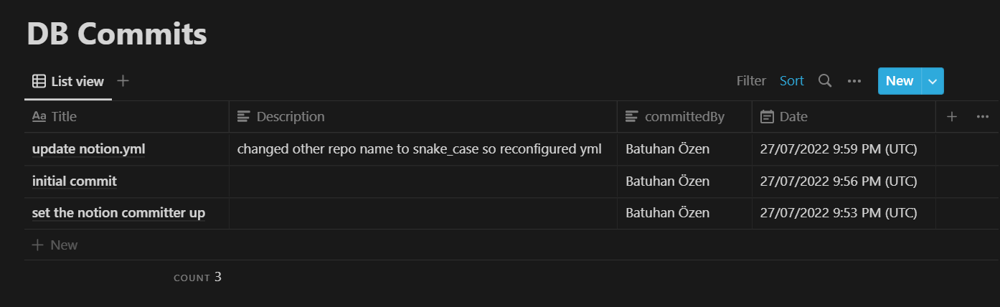

# How to setup
## Notion
- Create a Notion database and set all areas text except title (Its default is title and you can't change at the moment)

## Github
- Set your repositorie's secrets and create a yaml file in .github\workflows
- exact path must to look like this:
 >**.github\workflows\notion.yml**
 - Lastly, copy and paste the text written down below, into  your yaml file and reconfigure OWNER and REPO variables.

```yml
name: Commit to Notion CI

on:
  push:
    branches: [ "main" ]

jobs:
  build:
    runs-on: ubuntu-latest
    steps:
      - uses: bb7hn/notion_committer@main
        with:
          SECRET_GITHUB  : ${{ secrets.SECRET_GITHUB }}
          NOTION_API_KEY  : ${{ secrets.NOTION_API_KEY }}
          NOTION_DATABASE : ${{ secrets.NOTION_DATABASE }}
          OWNER : bb7hn
          REPO  : notion_committer
```
# Inputs
- GITHUB_TOKEN (required)
- NOTION_API_KEY (required)
- NOTION_DATABASE (required)
<br>

[Get Notion API KEY](https://developers.notion.com/docs/getting-started#step-1-create-an-integration)
<br>
[Get Notion DATABSE](https://stackoverflow.com/questions/67728038/where-to-find-database-id-for-my-database-in-notion)